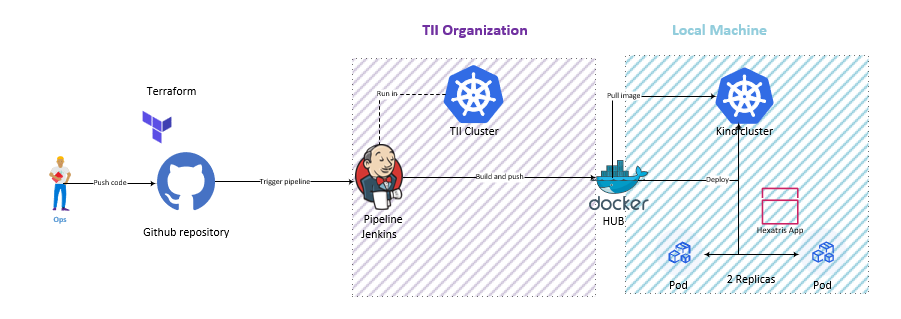

# Hextris DevOps Challenge - Kubernetes CI/CD Pipeline


## Overview

This project implements a production-ready CI/CD pipeline for deploying the Hextris web application to Kubernetes. The solution leverages infrastructure-as-code principles, containerization, and automated deployment pipelines aligned with modern DevOps practices.

**Key Technologies:** Terraform, Docker, Helm, Jenkins (Kubernetes agents), Kind

## Architecture



*CI/CD pipeline architecture showing the complete deployment lifecycle from code commit to production*

### Workflow Description

**1. Code Push** - Developers commit changes to GitHub repository

**2. Pipeline Trigger** - GitHub webhook triggers Jenkins in TII's Kubernetes cluster

**3. Build & Push** - Jenkins builds Docker image and pushes to Docker Hub registry

**4. Deploy** - Helm deploys application to Kind cluster with 2 replicas and auto-scaling

**5. Pull Image** - Kubernetes pulls application image from Docker Hub during deployment

The infrastructure is provisioned using Terraform, which creates the Kind cluster on the local VPS.

## Prerequisites

- VPS or local machine with Docker installed
- Docker Hub account
- GitHub account
- Access to TII Jenkins instance
- Terraform >= 1.5
- kubectl >= 1.28
- helm >= 3.13

You can find an installation script for all these requirements in /scripts

## Infrastructure Setup

### 1. Provision Kubernetes Cluster

The Kubernetes cluster is provisioned using Terraform with the Kind provider.

```bash
cd terraform
terraform init
terraform plan
terraform apply
```

This creates:
- Kind cluster with custom configuration
- Ingress controller (Nginx)
- Kubeconfig exported for external access

### 2. Verify Cluster

```bash
export KUBECONFIG=./hextris-cluster-config
kubectl cluster-info
kubectl get nodes
```

## Application Containerization

The application uses an Alpine-based Nginx container optimized for production:

```dockerfile
FROM nginx:alpine
COPY hextris-src/ /usr/share/nginx/html/
COPY nginx/default.conf /etc/nginx/conf.d/default.conf
EXPOSE 80
```

**Benefits:**
- Lightweight Alpine base (< 50MB)
- Static content served by Nginx
- Custom routing configuration

## Helm Chart Configuration

**Deployment:** 2 replicas, resource limits (CPU: 200m, Memory: 128Mi), liveness/readiness probes

**Service:** ClusterIP on port 80

**Ingress:** Nginx ingress controller with wildcard host

**Manual Deployment:**
```bash
helm upgrade hextris ./helm/hextris \
  --install \
  --namespace default \
  --set image.repository=erwanb44300/hextris \
  --set image.tag=build-23
```

## CI/CD Pipeline

### Jenkins Configuration

Jenkins runs in TII's Kubernetes cluster and uses pod templates with three containers:
- **docker**: Docker-in-Docker for image builds
- **helm**: Alpine/k8s for deployments  
- **kubectl**: Bitnami kubectl for verification

### Pipeline Stages

1. **Checkout** - Clone repository from GitHub
2. **Build** - Build and tag Docker image with build number
3. **Push** - Push image to Docker Hub registry
4. **Deploy** - Deploy application using Helm with kubeconfig
5. **Verify** - Check rollout status and pod health

**Key Features:**
- Declarative pipeline syntax
- Kubeconfig injected via workspace
- Automated cleanup and Docker pruning

## Security Considerations

| Aspect | Implementation | Notes |
|--------|----------------|-------|
| Credentials | Docker Hub password via stdin | No plaintext in pipeline logs |
| Kubeconfig | Workspace-scoped, deleted post-deployment | Prevents credential leakage |
| TLS | Disabled for Kind cluster | Development only - enforce in production |
| Resource Limits | CPU: 200m, Memory: 128Mi | Prevents resource exhaustion attacks |
| Image Registry | Private Docker Hub repository | Controlled access to artifacts |

## Deployment Verification

After successful pipeline execution:

```bash
# Check deployment status
kubectl get deployments

# Verify pods
kubectl get pods -l app=hextris

# Check service
kubectl get svc hextris

# View ingress
kubectl get ingress
```

Expected output:
- 2 running pods
- ClusterIP service on port 80
- Ingress with localhost address

## Local Testing

```bash
# Port forward for local access
kubectl port-forward svc/hextris 8080:80

# Open browser
http://localhost:8080

# Verify application health
curl -I http://localhost:8080
# Expected: HTTP/1.1 200 OK
```

## Testing Strategy

### Pipeline Validation
- **Dockerfile lint**: Validated build multi-stage process
- **Helm lint**: `helm lint ./helm/hextris` (0 errors)
- **Deployment verification**: Automated rollout status check in pipeline

### Health Checks
```bash
# Liveness probe (configured in deployment)
curl http://<pod-ip>:80/

# Readiness probe validation
kubectl get pods -l app=hextris -o jsonpath='{.items[*].status.conditions[?(@.type=="Ready")].status}'
# Expected: True True
```

### Load Testing (optional)
```bash
# Simple performance test
ab -n 1000 -c 10 http://localhost:8080/
```

## Troubleshooting

### Common Issues

**Pod not starting:**
```bash
kubectl describe pod <pod-name>
kubectl logs <pod-name>
```

**Helm deployment fails:**
```bash
helm list
helm rollback hextris <revision>
```

**Jenkins pipeline errors:**
- Verify kubeconfig validity
- Check container image availability
- Review Jenkins console output

## Technical Decisions

| Technology | Rationale |
|------------|-----------|
| **Kind** | Lightweight Kubernetes in Docker. Provides production-like environment with minimal overhead. Ideal for CI/CD testing and development workflows. |
| **Helm** | Industry-standard declarative deployments. Enables templating, versioning, and atomic rollbacks. Simplifies multi-environment management. |
| **Alpine Images** | Security-focused minimal base (~5MB vs 100MB+). Reduced attack surface and faster deployment times. |
| **Jenkins K8s Agents** | Ephemeral build agents with isolated containers. Resource-efficient and scalable. Eliminates agent maintenance overhead. |
| **Docker-in-Docker** | Enables Docker builds within Kubernetes pods. Isolated build environments prevent cache conflicts. |


## Author

Erwan B.  
DevOps Engineer  

## License

This project is created for the TII DevOps Engineer technical assessment.
